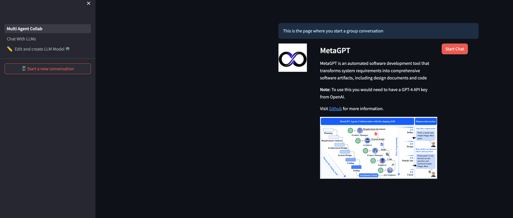
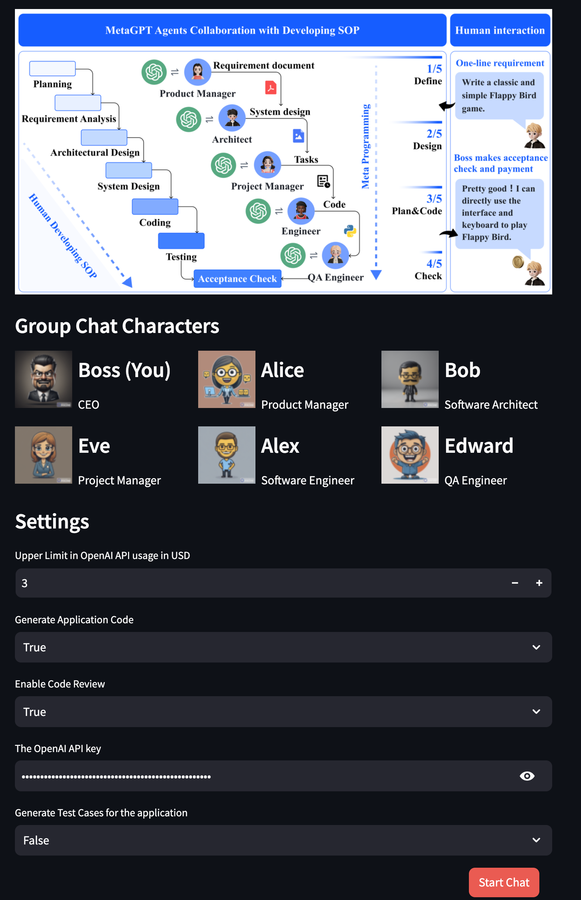
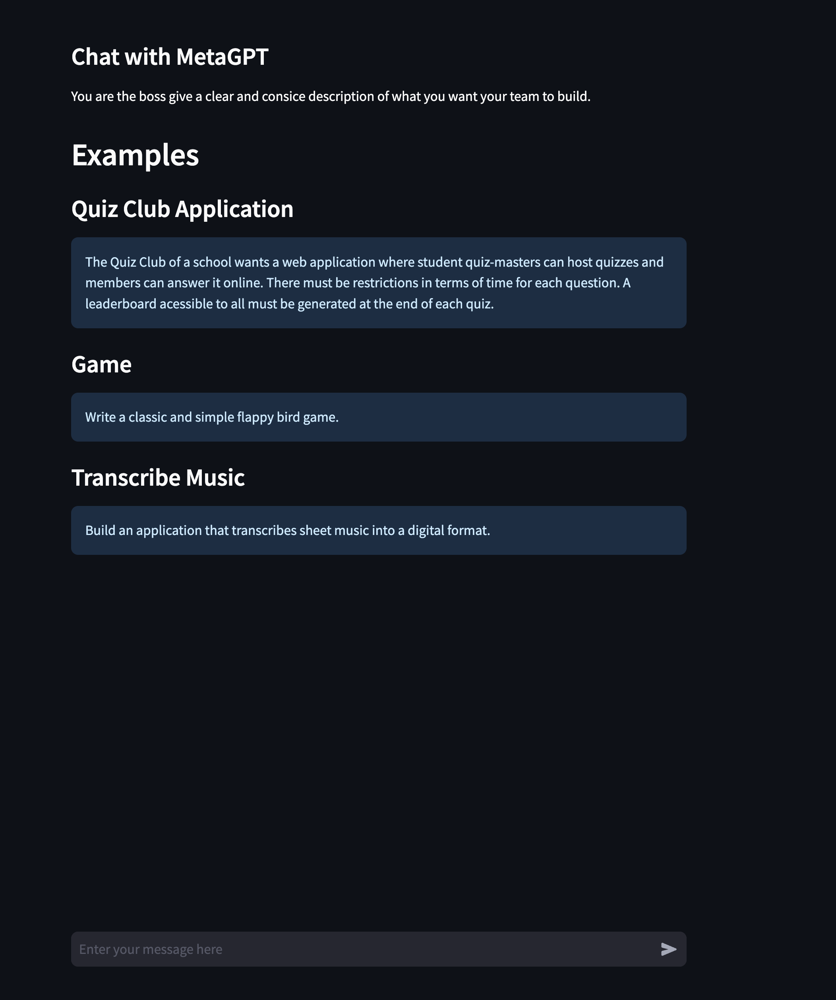
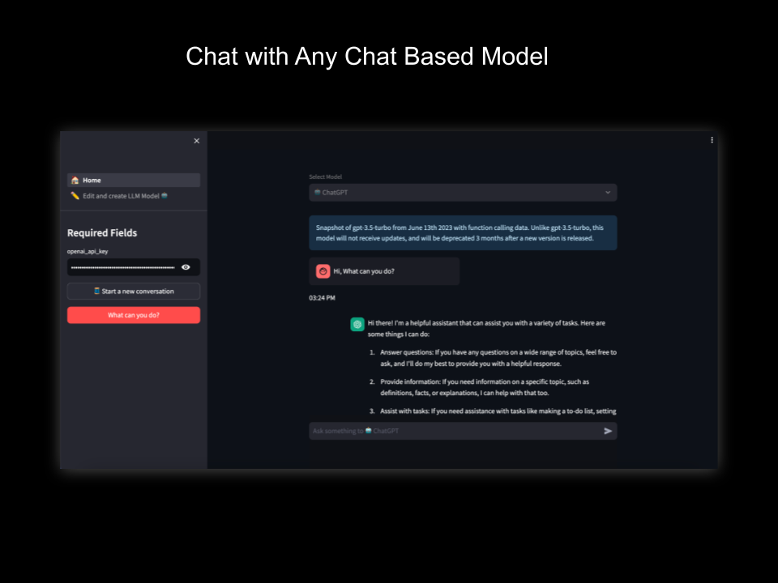
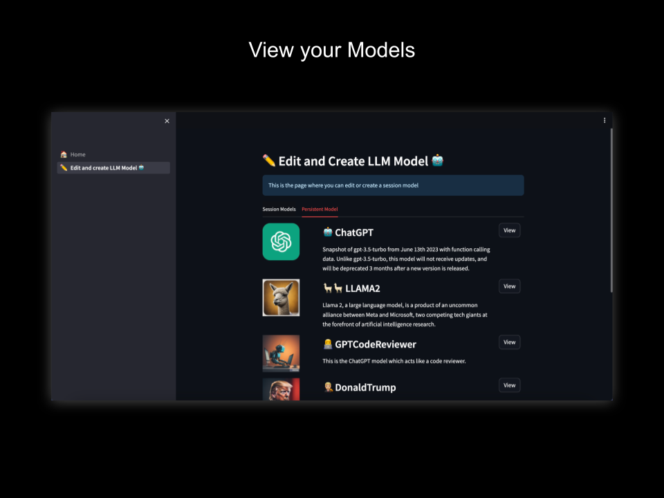
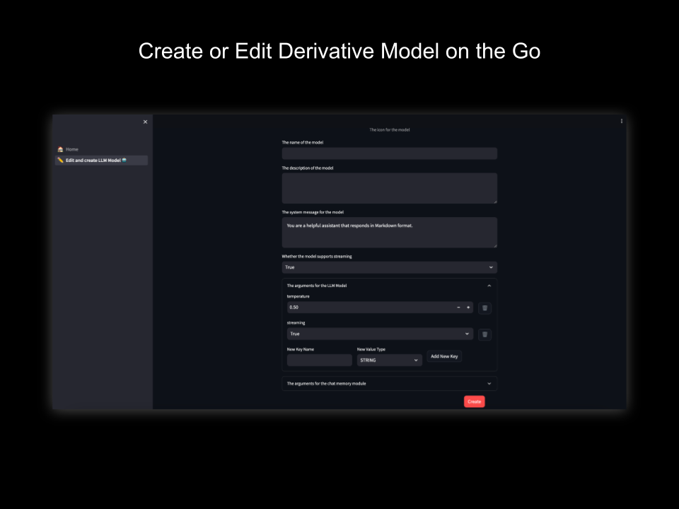

Introduction to AI ChatVerse
===============================
Dive into the world of conversational AI with AI Chatverse, a free and open-source application tailored for enthusiasts, developers, and AI aficionados alike. Built upon the robust foundation of Streamlit, AI Chatverse offers a user-friendly chat interface that seamlessly integrates with any chat model, be it from Langchain or a custom-built solution of your choice.

What sets AI Chatverse apart is its feature: 
* To experience multi-agent collaboration interactions with MetaGPT and more (in the future) to accomplish a task. 
* the ability to dynamically craft a 'session model'. These session models allow users to modify and experiment with existing models in real-time. Whether you're keen on tweaking the system prompt, adjusting hyperparameters like temperature, or just wish to test the waters with chatbot models, AI Chatverse offers a playground for all your experimentation needs.

Features
--------
* **Open Source and Free** The project has an opensource license.
* **Easy Integration with langchain** its very easy to integrate a model available in langchain.
* **Doesn't store data** We do not store any of your conversations, your messages are stored in streamlit sessions i.e once you close the App the data is gone!.
    
   *Note*: The model you use might store the data on it's end. Look into the specific model for more details.
* **Self-Hosted**: The application can be run in any environment which can run python application, we have dockerised the container so you can use that image as well.

The architecture
----------------

.. image:: ../../assets/AI\ ChatVerse\ Architecture.png
   :align: center
   :alt: chat view

